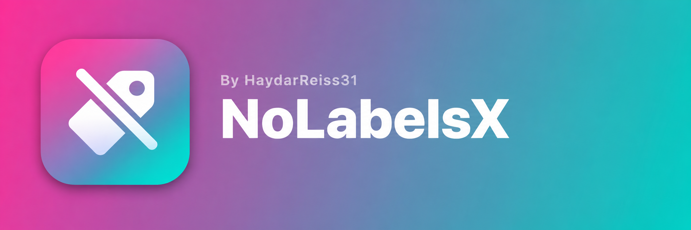

# NoLabelsX

A tiny rootless jailbreak tweak that hides the app name labels under Home Screen icons.

## Compatibility

- **Tested on:** iOS 15 (rootless)
- **Requires:** a rootless jailbreak (e.g. Dopamine, palera1n rootless, XinaA15) and iOS 15.0 or later
- Rootful jailbreaks (iOS 14 and below) are not supported by this build
- iOS 16+ is untested and may or may not work

## Installation

1. Download the latest `.deb` from the [Releases](../../releases) page (or from the Actions artifacts).
2. Install it with Sileo, Zebra or Filza.
3. Respring.

## Uninstall

Remove **NoLabelsX** from your package manager and respring.

## Building

Requires [Theos](https://theos.dev).

```sh
git clone https://github.com/HaydarReiss31/NoLabelsX.git
cd NoLabelsX
make package FINALPACKAGE=1
```

The rootless `.deb` is written to `packages/`. Builds also run automatically on GitHub Actions.

## How it works

The tweak hooks `SBIconView` in SpringBoard and hides its label subviews by class name, so it does not depend on private ivar names.

## Notes

- Notification badges are left untouched.
- If SpringBoard crashes into safe mode, remove the tweak in your package manager and respring.

## License

This project is licensed under the [GNU General Public License v3.0](LICENSE).
